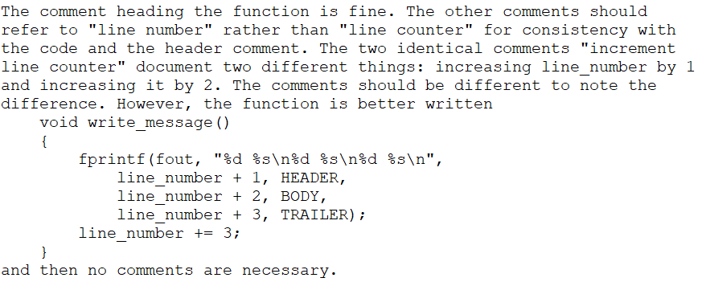

# Chapter 1

## Ex1-1

TRUE == 0 and FALSE == 1 is contrary to the convention of C, thus `not_eof` is better to rename as `is_eof` and set its value to TRUE.

## Ex1-2

```c
int lessEqual(char *s, char *t) {
    return strcmp(s, t) <= 0;
}
```

## Ex1-3

...

## EX1-4

```c
if (c != 'y' && c != 'Y')
    return;

length = min(length, BUFSIZE);
if(length > BUFSIZE) length = BUFSIZE;

flag = !flag;

quote = (*line == '"');

bit = val & 1;
```

## EX1-5

Order of `read(&val)` and `read(&ch)` is not well defined.

## EX1-6

I don't want to inspect undefined behavior.

## EX1-7

```c
if(!istty(stdin) && !istty(stdout) && istty(stderr)) return 0;

return retval;

for(k = 0; k < 5; ++k) {
    scanf("%lf", &dx);
    x += dx;
}
```

## EX1-8

While loop goes within [1, total] but not [0, total - 1].

The == operator checks equality of references, not string equality. The getName and userName methods presumably return strings.

```java
for(int count = 0; count < total; count += 1) {
    if(this.getName(count).equals(nametable.userName())) return true;
}
return false;
```

## EX1-9

`c` may be evaluate multiple times, and without parenthesis macro maybe expanded to the erroneous.

## EX1-10

```c
const double FT2METER  = 0.3048;
const double METER2FT  = 1.0 / 3.28084;
const double MI2FT 	   = 5280.0;
const double MI2KM	   = MI2FT * FT2METER / 1000.0;
const double SQMI2SQKM = MI2KM * MI2KM;
```

## EX1-11

- Comment is contradicting code that return nothing.
- Needless comment.
- 

# Chapter 2

## EX2-1

```c
#include<cstdlib>
#include<ctime>
#include<iostream>
#include<algorithm>
#include<vector>
#include<iomanip>
#include<stack>

enum {
	NUM_PER_LINE = 15,
	n = 1024,
};

using std::cout;
using std::endl;
using std::vector;
using std::stack;

void print_arr(const vector<int> &arr, const char *banner, const int n);
// both using Hoare-Partition
void quicksort_r(vector<int> &arr, const int begin, const int end);
int  partition(vector<int> &arr, const int begin, const int end);
void quicksort_i(vector<int> &arr, const int begin, const int end);

int main()
{
	vector<int> arr;

	for(int i = 0; i < n ; ++ i) {
		arr.push_back(rand() % 65537);
	}
	
	vector<int> std(arr);
	vector<int> q_r(arr);
	vector<int> q_i(arr);

	print_arr(arr, "Original Array:", n - 1);
	
	std::sort(std.begin(), std.end());
	print_arr(std, "std::sort ed Array:", n - 1);
	
	quicksort_r(q_r, 0, n - 1);
	print_arr(q_r, "quicksort_ed Array with recursive method:", n - 1);
	
	quicksort_i(q_i, 0, n - 1);
	print_arr(q_i, "quicksort_ed Array with iterative method:", n - 1);
	
	return 0;
}

void print_arr(const vector<int> &arr, const char *banner, const int n) {
	cout << banner << endl;
	for(int i = 0; i < n ; ++i) {
		cout << std::setw(5) << arr[i];
		if ((i+1) % NUM_PER_LINE == 0) cout << endl;
		else std::cout << "\t";
	}
	cout << endl;
}

void quicksort_r(vector<int> &arr, const int begin, const int end) {
	if(begin >= end) return;
	int p = partition(arr, begin, end);
	quicksort_r(arr, begin, p - 1);
	quicksort_r(arr, p + 1, end);
}

int partition(vector<int> &arr, const int begin, const int end) {
	int x = arr[begin];
	int i = begin, j = end;
	while(i < j) {
		while(arr[j] > x) --j;
		while(arr[i] < x) ++i;
		if(i < j) std::swap(arr[i], arr[j]);
	}
	return j;
}

void quicksort_i(vector<int> &arr, const int begin, const int end) {
	stack<int> s;
	s.push(begin);
	s.push(end);
	while(!s.empty()) {
		int end = s.top();
		s.pop();
		int begin = s.top();
		s.pop();
		if(begin >= end) continue;
		int x = arr[begin];
		int i = begin, j = end;
		while(i < j) {
			while(arr[j] > x) --j;
			while(arr[i] < x) ++i;
			if(i < j) std::swap(arr[i], arr[j]);
		}
		s.push(begin);
		s.push(j - 1);
		s.push(j + 1);
		s.push(end);
	}
}
```

## EX2-2

I don't want do it. :p.

## EX2-3

Sorted array.

## EX2-4

Insertion sort.

## EX2-5

Worth. If array can grow up as `delname` before, it's likely to be that large again.

## EX2-6

I don't want to implement it because this idea is bad.

No need to mark it, but just decrement the size is enough.

---

I decided to omit the rest of chapter 2 because of my arrogance. ;P

# Chapter 3

